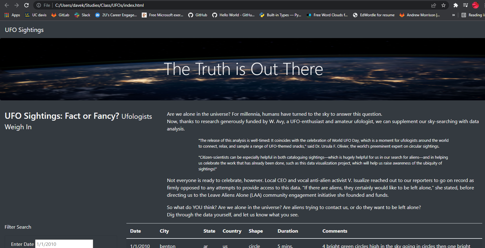
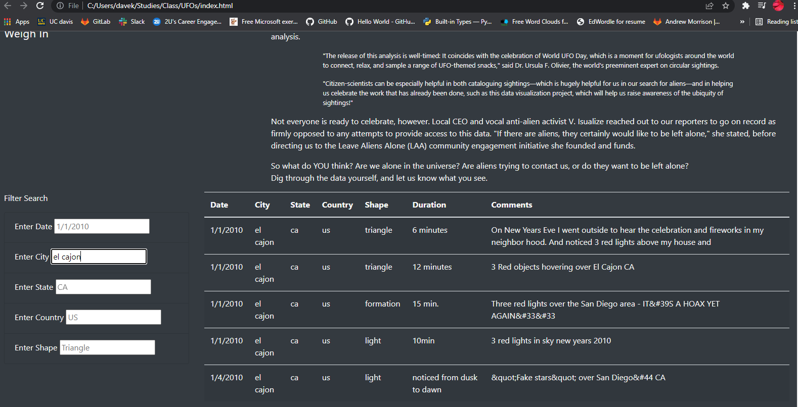
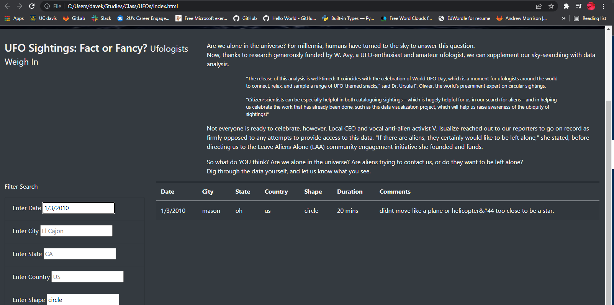
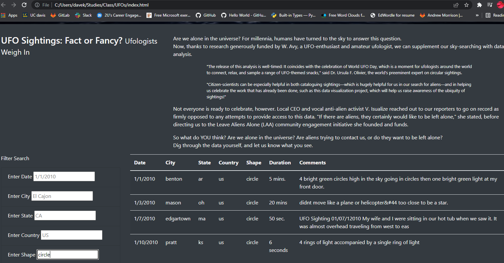
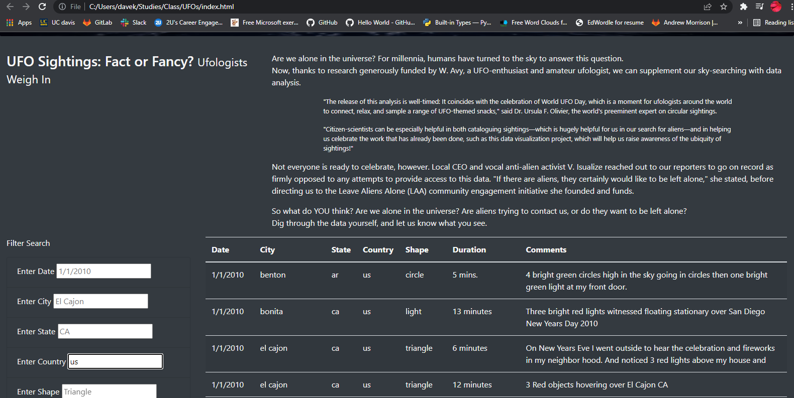
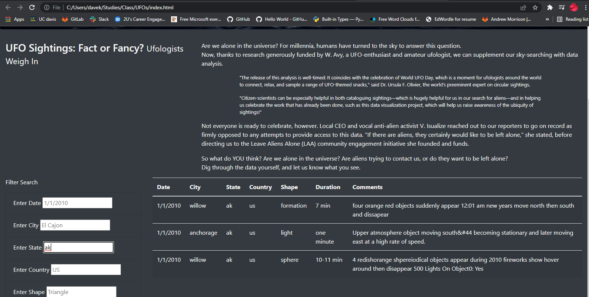

# UFOs - UFO Sightings with JavaScript and HTML
### Unit 11 - JavaScript

## Overview of the Analysis:
  - The purpose of this challenge was to present and provide a more in-depth analysis of UFO sightings by allowing users to filter for multiple criteria at the same time. In addition to that, we added table filters for the city, state, country, and shape of the UFO sightings. Here the country was "us" for the whole data, but if we had more data from all over the world, we could use the filter set for the country to get the results for a specific country. We learned and presented the skills we learned with javascript, html, and bootstrap with this challange.

  ## Results:
  -  We created a webpage with data presented in a table. We used the following skills during this analysis:
      - console.log() to debug the code
      - create variables with var and let
      - used JavaScript functions, arrow functions, forEach() with JavaScript objects, if-else statements.
      - used and created filters with d3.select()
 
 ### Here are some snapshots from our final results:
 
   

  - This is how it looked when we filtered by city:
    
      
      
  - Here is how it looked when we filtered by the date:
    
     
     
  - This is how it looked when we filtered the data by shape of the UFO:
    
      
      
  - Here is how it looked when we filtered the data by Country:
    
      
      
  - This is what it looked like when we filtered by State:
    
      
      
 
 ## Summary:
 
This was a fun challenge to complete overall. Though the drawback was that we only had data from the USA. We still added filter for a country. Right now we don't have data for other countries, but in case we get data from multiple countries, we can use the filter and we can see the filtered data for different countries.

Here are two additional recommendations for further development:
 - Currently, we can only filter the data for one key; it is unspoorted if we want to search for more than one city or state or wish to search by a given date range.
 - We can add a "Contact Us" field, and if someone claims to have seen a UFO, we can submit their details with a picture of the UFO. 
